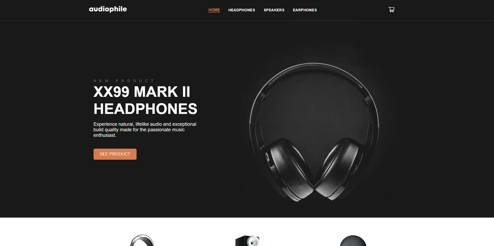
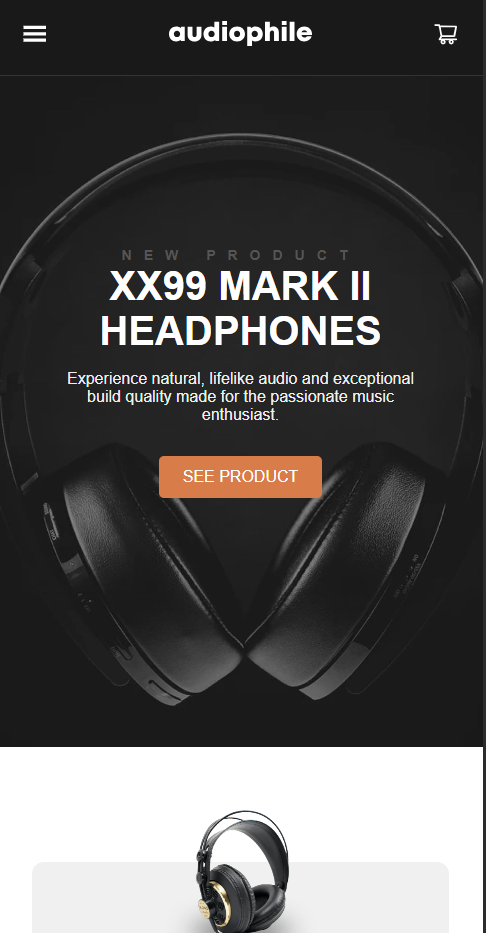

# Audiophile e-commerce website

This is a solution to the [Audiophile e-commerce website challenge on Frontend Mentor](https://www.frontendmentor.io/challenges/audiophile-ecommerce-website-C8cuSd_wx). Frontend Mentor challenges help you improve your coding skills by building realistic projects. 

## Table of contents

- [Overview](#overview)
  - [Screenshot](#screenshot)
  - [Links](#links)
- [My process](#my-process)
  - [Built with](#built-with)
- [Author](#author)

## Overview

### Screenshot

### Links

- Solution URL: [GitHub](https://github.com/leonardoalmeida7/audiophile_ecommerce_website)
- Live Site URL: [Live Site Url](https://leonardoalmeida7.github.io/audiophile_ecommerce_website/)

## My process

### Built with

- Semantic HTML5 markup
- CSS custom properties
- Flexbox
- CSS Grid
- Mobile-first workflow
- [React](https://reactjs.org/) - JS library

## Author

- Website - [Leonardo](https://leonardoalmeida7.github.io/my_portfolio/)
- Frontend Mentor - [@leonardoalmeida7](https://www.frontendmentor.io/profile/leonardoalmeida7)
